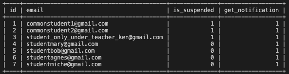

# **TOPPAN NodeJS API Asessment**

## Background

Teachers need a system where they can perform administrative functions for their students. Teachers and students are identified by their email addresses.
Your Task

_Task is to:_

1. _Develop a set of API endpoints for teachers to perform administrative functions for their classes._

#

## **MySQL Schema**

## **DEPLOYED API LINK** 

| Links to API & Code |                                       |
| ------------------- | ------------------------------------- |
| DEPLOYED API LINK   | https://toppan-api-tech.onrender.com/ |
| Code                | https://github.com/99Ace/toppan-api   |

### **Reset / Clear the database**

1. To reset the tables with the default data:- [POST] https://toppan-api-tech.onrender.com/api/reset

2. To empty all tables:- [POST] https://toppan-api-tech.onrender.com/api/clear

## **API routes**

_Route 1 : As a teacher, I want to register one or more students to a specified teacher._

- [POST] https://toppan-api-tech.onrender.com/api/register

      [Sample body]:
      {
         "teacher": "teacherken@gmail.com" "students":
         [
         "studentjon@gmail.com", "studenthon@gmail.com"
         ]
      }

_Route 2 : As a teacher, I want to retrieve a list of students common to a given list of teachers (i.e. retrieve students who are registered to ALL of the given teachers)._

- _a. Search for teacherken only_\
  [GET] https://toppan-api-tech.onrender.com/api/commonstudents?teacher=teacherken%40gmail.com

- _b. Search for students under teacherken and teacherjon_\
  [GET] https://toppan-api-tech.onrender.com/api/commonstudents?teacher=teacherken%40gmail.com

_Route 3 : As a teacher, I want to suspend a specified student._

- [POST] https://toppan-api-tech.onrender.com/api/suspend

      [Sample body]:
      {
      "student" : "studentmary@gmail.com"
      }

_Route 4 : As a teacher, I want to retrieve a list of students who can receive a given notification._

> _To receive notifications from e.g. 'teacherken@gmail.com', a student:_

- MUST NOT be suspended,
- AND MUST fulfill AT LEAST ONE of the following:

  - is registered with “teacherken@gmail.com"
  - has been @mentioned in the notification

<!--   -->

- [POST] https://toppan-api-tech.onrender.com/api/retrievefornotifications

| Students under teacherken<!-- -->@gmail.com      | Suspended | Get Notifications |
| ------------------------------------------------ | :-------: | :---------------: |
| commonstudent1<!-- -->@gmail.com                 |  Yes \*   |        Yes        |
| commonstudent2<!-- -->@gmail.com                 |  Yes \*   |        Yes        |
| student_only_under_teacher_ken<!-- -->@gmail.com |    No     |       No \*       |
| studentbob<!-- -->@gmail.com                     |    No     |        Yes        |

| Students under other teachers  | Suspended | Get Notifications |
| ------------------------------ | :-------: | :---------------: |
| studentagnes<!-- -->@gmail.com |    No     |        Yes        |
| studentmiche<!-- -->@gmail.com |    No     |        Yes        |

      [Sample body 1]:
      {
         "teacher": "teacherken@gmail.com",
         "notification": "Hello students! @studentagnes@gmail.com @studentmiche@gmail.com"
      }
      [Sample body 2]:
      {
         "teacher": "teacherken@gmail.com",
         "notification": "Hello everyone"
      }

## **Technology & Packages**

- Node
- MySQL
- Express
- Dotenv

## **Credits**

- Stackoverflow : https://stackoverflow.com/ - reference from stackoverflow
- Render : https://render.com/ - hosting the api
- FreeSQLDatabase : https://www.freesqldatabase.com/ - hosting mySQL database
